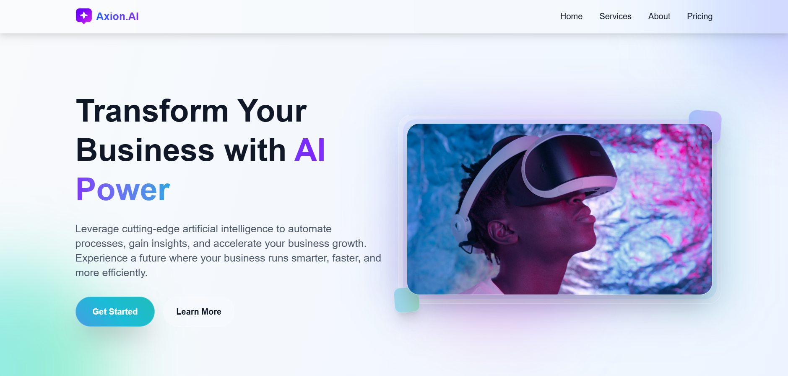
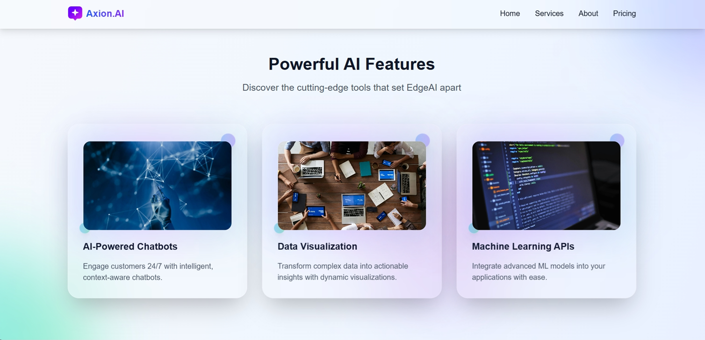
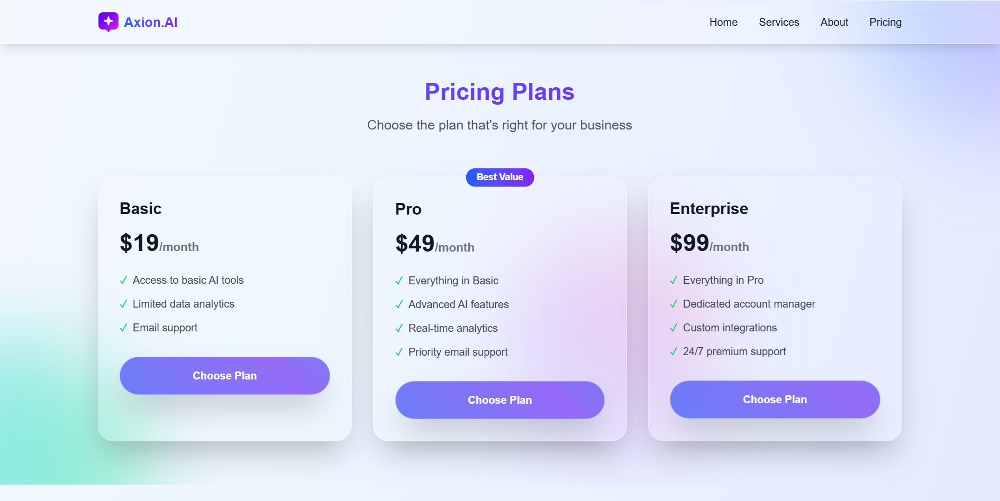

Axion AI — SaaS Landing Page

A modern, responsive SaaS landing page frontend built using React, TypeScript, and Tailwind CSS.
This project showcases clean UI/UX design, reusable component architecture, and scalable frontend development practices suitable for real-world SaaS products.

🌐 Live Demo:
👉 https://axion-ai-an-saa-s-landing-page-kd2m.vercel.app/

# 📸 Screenshots

Hero Section:


Features:


Pricing:


# Overview

Axion AI is a frontend-only project designed to represent an AI-focused Software-as-a-Service (SaaS) platform.
The goal of this project was to build a conversion-focused landing page that clearly communicates product value, highlights features, and provides a smooth, responsive user experience across all devices.

# ✨ Features

- Smooth Scrolling: Integrated with Lenis for a buttery-smooth, modern scrolling experience

- Built with React and TypeScript for scalable, type-safe development

- Styled using Tailwind CSS with a modern and clean design system

- High-performance scroll-triggered animations using framer-motion

- Fully responsive & mobile-first layout

- Modular and reusable React components

- Fast performance and optimized build

- Clear call-to-action sections for SaaS-style user engagement

# 🛠️ Tech Stack

• Frontend: React, TypeScript

• Styling: Tailwind CSS, framer-motion

• Build Tool: Vite

• Deployment: Vercel

# 📂 Project Structure
```
src/
├── components/     # Reusable UI components
├── pages/          # Page-level components
├── assets/         # Images & static assets
├── styles/         # Global styles (if any)
├── App.tsx
└── main.tsx
```

# ⚙️ Installation & Setup

Follow these steps to run the project locally:

# Clone the repository
```git clone https://github.com/your-username/axion-ai-saas-landing-page.git```

# Navigate to the project directory
```cd axion-ai-saas-landing-page```

# Install dependencies
```npm install```

# Start development server
```npm run dev```


The app will be available at http://localhost:5173

# 📚 What I Learned

• Structuring scalable React applications with TypeScript

• Building responsive layouts efficiently using Tailwind CSS

• Designing SaaS landing pages with a focus on user experience and conversion

• Component reusability and clean frontend architecture

• Deploying frontend projects using Vercel


# 👤 Author

A S M Sharif Mahmud Sazid

🌐 Portfolio: https://my-portfolio-v42.vercel.app/

💼 LinkedIn: https://linkedin.com/in/sharif-mahmud-sazid

💻 GitHub: https://github.com/sazid-zero

# ⭐ Support

If you like this project, consider giving it a ⭐ on GitHub — it really helps!
